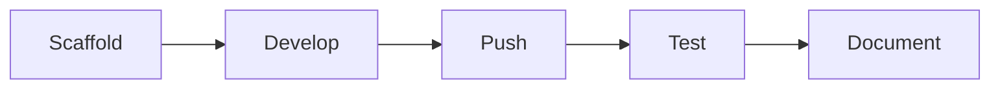

# Speed to Lead Autopilot


**Automated lead qualification and response in <5 minutes.** Webhook receives inquiry, LLM qualifies the lead, Google Sheets logs it, personalized email goes out, and the team gets notified on Slack.

## Architecture

```
Webhook (POST /lead) → AI Agent (qualify) → Code (prepare CRM data)
  → Google Sheets (log all leads)
  → Switch (route by score: hot/warm/cold/spam)
    → Gmail (personalized response for hot/warm/cold)
    → Slack (team notification for hot leads only)
```

## Setup — Credentials Needed (Class A)

Before the workflow can run end-to-end, provision these credentials in n8n UI:

| Credential | Type | Node | How to Create |
|---|---|---|---|
| Google Sheets | `googleSheetsOAuth2Api` | Log to Google Sheets | Settings > Credentials > Add > Google Sheets OAuth2 |
| Gmail | `gmailOAuth2` | Send Response Email | Settings > Credentials > Add > Gmail OAuth2 |
| Slack | `slackOAuth2Api` | Notify Team | Settings > Credentials > Add > Slack OAuth2 |

The **OpenRouter** credential (type `openAiApi`) is already configured for the AI Agent.

After creating credentials, update the credential IDs in `speed-to-lead.workflow.ts` (replace `TODO` placeholders) and re-push.

## Google Sheets Setup

Create a Google Sheet with these column headers in row 1:

`Timestamp | Name | Email | Phone | Service | Message | Source | Score | AI_Summary | Recommended_Action | Response_Sent | Response_Time_Sec | Status`

Then set the `documentId` and `sheetName` in the workflow file.

## Testing

```bash
# Activate and test with first mock lead
npx --yes n8nac workflow activate TIVWeyLp1e0FMdeC
npx --yes n8nac test TIVWeyLp1e0FMdeC --prod --data '{"name":"Thomas Müller","email":"t.mueller@autohaus-mueller.de","phone":"+49 171 1234567","service":"KI-Automatisierung","message":"Budget ist vorhanden, Werkstattplanung automatisieren.","source":"Website"}'

# All 10 test leads are in test-leads.json
```

## Quick Start

```bash
# 1. Clone this template
git clone https://github.com/YOUR-USER/YOUR-PROJECT.git
cd YOUR-PROJECT

# 2. Install dependencies
npm install

# 3. Connect to your n8n instance
npx --yes n8nac init

# 4. Enable pre-commit secret detection
git config core.hooksPath .githooks

# 5. Scaffold your first workflow
npm run new-workflow -- agents/01-my-agent "My First Agent"

# 6. Build, push, test
npx --yes n8nac push my-first-agent.workflow.ts
```

## What's Included

| Directory | Purpose |
|---|---|
| `workflows/` | Your workflow directories (scaffolded by `new-workflow.sh`) |
| `workflow/` | Root-level workflow export for standalone distribution |
| `template/` | Scaffold source files for new workflows |
| `scripts/` | `new-workflow.sh` (scaffold) + `check-secrets.sh` (pre-commit) |
| `assets/` | Screenshots, diagrams, and visual assets |
| `docs/` | GitHub Pages site + Architecture Decision Records |
| `.beads/` | [Beads](https://github.com/steveyegge/beads) AI-native issue tracker |
| `.githooks/` | Pre-commit secret detection |
| `.github/` | Issue templates, funding config, Pages CI |

## Workflow Lifecycle



1. **Scaffold** a new workflow directory with `npm run new-workflow`
2. **Develop** in n8n UI or write `.workflow.ts` directly
3. **Push** to n8n with `npx --yes n8nac push <filename>.workflow.ts`
4. **Test** with `npx --yes n8nac test <id> --prod`
5. **Document** the README, benchmarks, and test payloads

## Commands

```bash
# Scaffold a new workflow
npm run new-workflow -- agents/01-my-agent "My Agent Name"

# Check for accidentally committed secrets
npm run check-secrets

# Validate root workflow JSON
npm run validate

# n8nac workflow operations
npx --yes n8nac list                    # List all workflows
npx --yes n8nac pull <id>              # Pull from n8n
npx --yes n8nac push <file>.workflow.ts # Push to n8n
npx --yes n8nac verify <id>            # Validate live workflow
npx --yes n8nac test <id> --prod       # Test webhook workflows

# Beads issue tracking
bd ready              # Find available work
bd create "Title"     # Create an issue
bd close <id>         # Complete work
bd sync               # Sync with git
```

## Workflow Structure

Each scaffolded workflow gets:

```
workflows/<category>/<slug>/
├── README.md           # Overview, flow diagram, test instructions
├── workflow/
│   ├── workflow.ts     # n8nac TypeScript source
│   └── workflow.json   # n8n JSON export (for UI import)
├── test.json           # Test payloads
└── benchmark.md        # Performance data (if applicable)
```

For standalone distribution, the root `workflow/workflow.json` contains a single exportable workflow.

## Categories

| Category | What Goes Here |
|---|---|
| `agents` | AI agent workflows (LLM-driven, tool-calling) |
| `pipelines` | Data processing pipelines (ETL, enrichment) |
| `triggers` | Event-driven automations (webhook, schedule, RSS) |
| `utilities` | Helper workflows (health checks, monitoring) |

## Setup

### Pre-commit Hook

Enable the secrets check hook:

```bash
git config core.hooksPath .githooks
```

### GitHub Pages

The `docs/` directory is auto-deployed to GitHub Pages on push. Enable Pages in your repo settings:

```bash
# Via GitHub CLI
gh api repos/{owner}/{repo}/pages -X POST -f build_type=workflow
```

Then edit `docs/index.html` with your project details.

### AI Agent Support

All three agent instruction files are committed and work natively — no manual setup needed:

- **`CLAUDE.md`** — Auto-read by Claude Code at startup. References both files below.
- **`@AGENTS.md`** — Auto-read by Codex. Beads workflow, session protocol, "Landing the Plane".
- **`AGENTS.md`** — Stub until you run `npx --yes n8nac init`, which generates the full n8nac protocol.

### Beads Issue Tracking

This template includes [Beads](https://github.com/steveyegge/beads) (`bd`) for AI-native issue tracking:

```bash
bd onboard    # Get started
bd ready      # Find available work
bd sync       # Sync issues with git
```

## Documentation

- [GitHub Pages Site](https://YOUR-USER.github.io/YOUR-PROJECT/) — project overview with Mermaid diagrams
- [Architecture Decision Records](docs/decisions/) — documented design choices

## License

MIT
